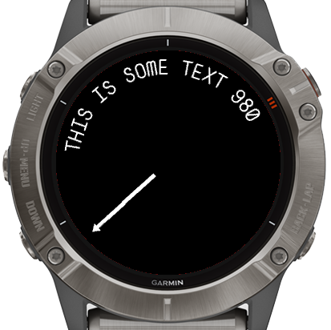

# A Garmin watch face example using antiliased rounded text and hands



This is an example watch face created using a truetype font and the included `generatefonts.sh` script to produce antialiased hands and text placed around the bezel of the watch.

This watch face is an example and not meant to be usable. The code included is the minimum required to demonstrate the technique and doesn't include optimisations such as clipping.

## Building the watch face

There is a `Dockerfile` included which will install the Garmin SDK and [ImageMagick](https://imagemagick.org), generate the fonts, build the watch face and run it in the simulator. If you are on a linux machine with docker and X11, running `./run.sh` should do all this for you.

Without docker you will need to install the requirements below, generate the fonts by running the `generatefonts.sh` commands and build the watch face using your dev setup and the Garmin SDK.

## Requirements

1. A UNIX machine such as Linux or MacOS or a Linux VM
2. [ImageMagick](https://imagemagick.org) which is used to produce the font files compatible with Garmin watches. This is available to install in most Linux distributions
3. A font (any format acceptable by ImageMagick, eg `ttf` or `otf`) (an example `font.ttf` is included here)
4. A font editor such as [FontForge](https://fontforge.org) to draw any symbols you want to use in your watch face, such as the hands

## Generating the fonts

1. Change into the directory where you want to create the font eg `resources/fonts`
2. Run the script, referencing the font and the characters you want to include

```
Usage: generatefonts.sh <font file> <font name> <font size> <list of characters to include> <trim blank space>
eg:
generatefonts.sh ../../myfont.ttf myfont 18 6 6 "A B C D E F SPACE STAR ( #" no

trim blank space is useful for clock hands, yes to trim no or blank to not trim
```

- example for a font to be used in text around the edge of the watch in `resources/fonts`
    
`../../generatefonts.sh ../../font.ttf font 21 "A B C D E F G H I J K L M N O P Q R S T U V W X Y Z 0 1 2 3 4 5 6 7 8 9 -"`

- example for a font to be used for drawing hands on the watchface in `resources/hands`, note the `yes` on the end which strips blank space around the font so the hand pieces can be lined up properly

`../../generatefonts.sh ../../font.ttf hand 36 "( ) STAR" yes`

## Using the fonts 

Take a look at the code in `RoundTextView.mc` which includes some functions for using the fonts

- `getHand` and `getFont` which load the correct font for the position at which the hand or letter is being drawn. Since the total size of all the fonts used is quite big, the `getFont` function includes an LRU cache used to allow the fonts to be loaded and unloaded from memory when memory is low.
- `generateLookup` creates encoded lookup tables of the x and y coordinate and font resources for drawing the hands and letters at different angles around the watch face. Using these lookup tables means that expensive rotation calculations don't have to be run every time the face is drawn.
- `drawBezelText` draws an antialiased text string of maximum 60 characters around the edge of the watch face
- `drawHand` draws an antialiased hand at a specified position (0-60) on the watch face

## How it works

The script creates antialiased images of each letter using the font file, rotates the letter from -90 to 90 degrees and combines the images of all the letters into a single font image and font file reference per angle. You can see this only equates to 180 degrees rather than 360 in a circle. This is because the bottom half of the watch face will re-use the rotated characters from the top half. Rotating further than 90 degreens would mean the letters would be printed upside down and unreadable. The `generateLookup` and `drawBezelText` code handles this translation.

For watch hands, the same system is used. The arm parts of a watch hand will work with this arrangement since they will be the same upside down. For the end parts of the arm, where there might be an arrow, the system doesn't work since resuing the top rotations on the bottom means the arrow is still pointing up. To solve this, an extra character is used (with the arrow pointing down) for the end parts in the bottom half of the face. See `drawHand` for how this is handled. In the example the * character is used for the main arm part and ( and ) are used for the up and down arrow parts of the arm.

## Limitations

The example code works best with monospaced fonts since the code generates lookups for a fixed 60 position ring around the watch face. The font script will generate variable width fonts but the code would have to be changed to measure the width of each character and place it at varying angles around the watch face rather than placing each character 6 degrees apart as in the example.

These font files can be quite large and memory size is limited on Garmin devices. For most devices the fonts for all the angles will not fit into memory so only some angles can be loaded at a time, which makes redrawing slow. To mitigate this, use as few characters as you can (if none of your UI uses an X, dont include it in the font!), try to use only lower or upper case characters and create a font of the smallest pixel size that works for your design. As long as the font for one particular angle can fit in memory the font can be used but loading fonts is expensive so should be done as little as possible. 

Using non antialiased fonts is another possibility to reduce the memory requirements but since rotating at the low resolution these fonts are at creates quite a lot of aliasing which does not look very good. To modify the script to not antialias, add `+antialias` , `-filter point` and `-interpolate nearest` to the `convert` commands in the script and set `antialias="false"` in the `<font>` line. Using non-antialiased fonts allows the use of limited pallette `BufferedBitmap` objects which opens up opportunities for caching drawing of the text which otherwise might not be feasible since a full pallette `BufferedBitmap` will not fit in the memory of most devices.
